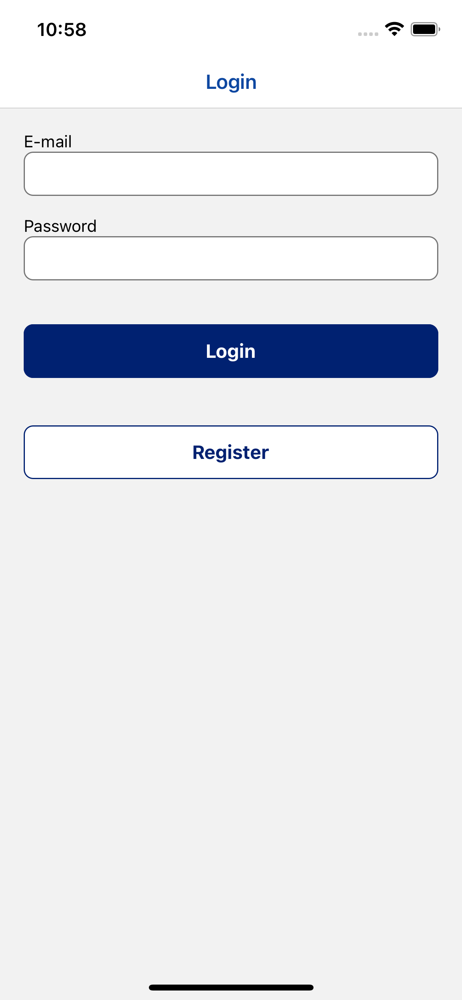
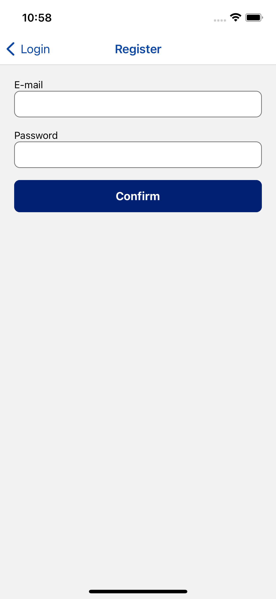
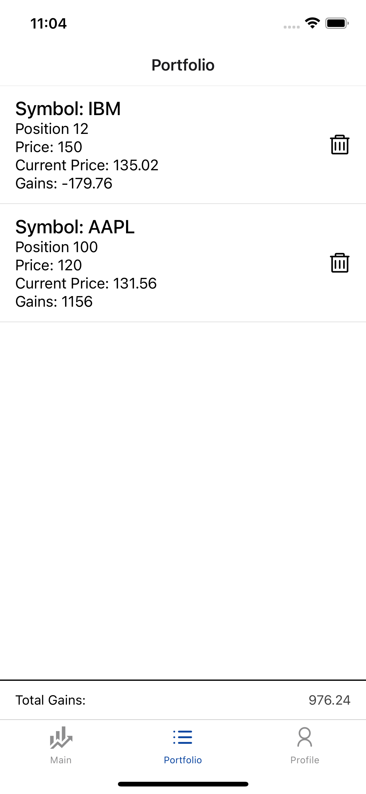

# Development Environment
The project is using Expo(react-native). Before starting development, make sure you have installed the following things.
1. Expo CLI version: 5.4.11 or above
2. Xcode version: 13.4.1 or above
3. Android Emulator (If you want to test on a Android vritual device)

# Building stepd
1. clone the project
2. run `$yarn install`
3. run `$yarn start`
# Qualification Test Frontend Developer

**Summary**

Design a mobile application that enables users to search for financial instruments (stocks, etfs, commodities, crypto) on the NYSE/Nasdaq stock exchanges, learn more information about the stocks, and add them to their portfolio.

**Deliverables**

* Attempt to implement the design using a Framework such as React Native, Ionic, Flutter or a strategically typed language such as Kotlin,  or a dynamically typed language such as JavaScript or any of the frameworks it supports (Angular 8.0 or later, Reactjs, Vue.js)

Framework: Expo(react-native)

* The user will be able to undertake the following actions in the mobile app:
  * Register and login users via:
    * Phone Number (Account / Username)
    * Password (OTP)

  * Search for financial instruments by ticker, common name, or other terms
  
  

  * View information on the financial instrument
    * Realtime price of the financial instrument
    * Historical price data of the financial instrument
    * News related to the financial instrument, user should be able to click on the source, and be redirected to the source’s origin.

  

  * Share the financial instrument with external parties.

  

  * Follow the financial instrument in the process adding it to their watchlist (portfolio)

  * Manage their watchlist by adding or removing financial instruments

  

  * Have an overview of the losses and gains in their portfolio

  **Note:** <ins>Screens above are only for reference, please create other screens based on similar look and feel if necessary, to demonstrate the functionality requested above.</ins>

* You will need to use the following 3rd-party services to make the application functionable:
  * User and data management -> <a href="https://firebase.google.com">Firebase</a>
  * Financial instrument data -> <a href="https://www.alphavantage.co">Alpha Vantage</a>
  * Bring search capability to mobile application -> <a href="https://www.algolia.com" >Algolia</a>
* We would be looking for the following with your submission:
  * Git committed code of the solution with a guide on how to run the application
  * Document detailing your planning, thinking, and development process
https://whimsical.com/synpulse-9WcBxijQ1V2M6YxgHWKBZV@2Ux7TurymN9CvtLzKj2G
<iframe style="border:none" width="800" height="450" src="https://whimsical.com/embed/9WcBxijQ1V2M6YxgHWKBZV@2Ux7TurymN9CvtLzKj2G"></iframe>
  * Suitable test cases for all functionality implemented
  https://github.com/AnthonyXcode/synpluse_test/blob/master/redux/slice/__test__/instrements.test.ts

  **Note:** <ins>Please publish the app in a functional manner and provide us a working link.</ins>
